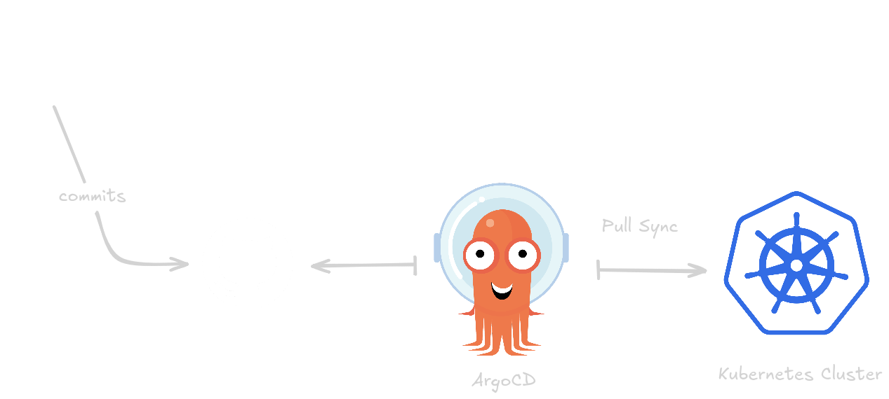
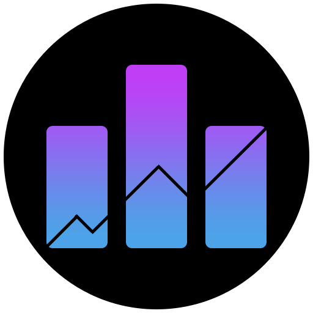
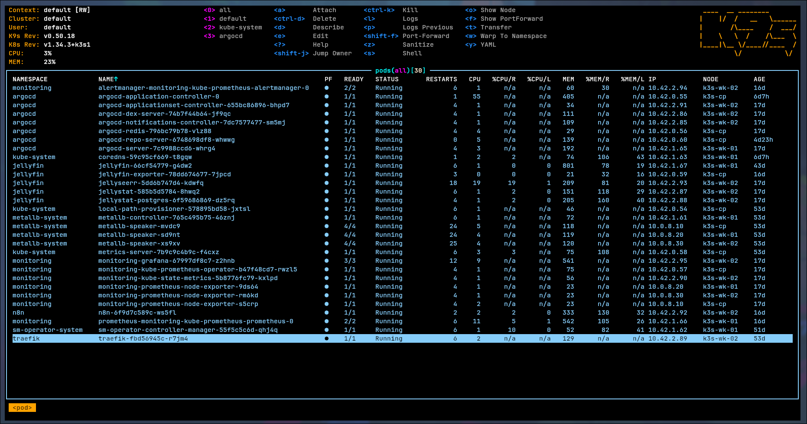
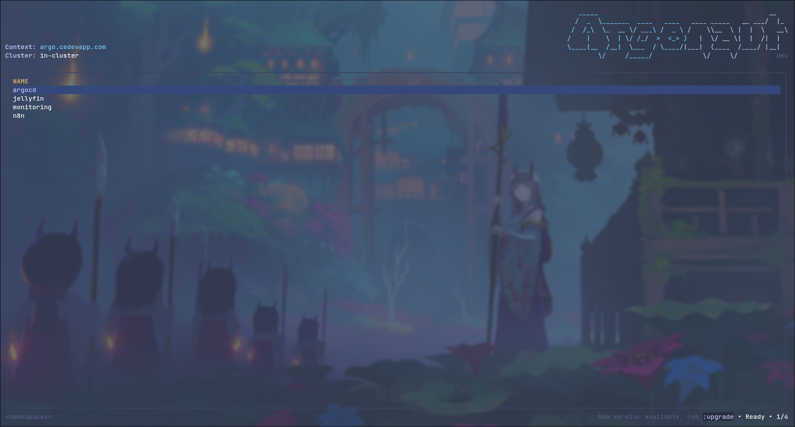

# Infrastructure Kubernetes K3s - Projet DevOps B3

## Architecture du Cluster

### Nodes


| Node       | Rôle            | Système          |
|------------|-----------------|------------------|
| k3s-cp     | Control-Plane   | Ubuntu 24.04 LTS |
| k3s-wk-01  | Worker          | Ubuntu 24.04 LTS |
| k3s-wk-02  | Worker          | Ubuntu 24.04 LTS |

Voir la documentation [ici](./IAC.md)

---

## Arborescence du Projet

```
Devops-B3/
├── .github/
│   └── workflows/
│       └── ci.yml                  # Pipeline CI (Lint & Scan Trivy)
├── helm-apps/
│   ├── root-app.yaml               # Application "App of Apps" racine
│   ├── jellyseerr/
│   │   ├── application.yaml        # ArgoCD Application (chart TrueForge OCI)
│   │   └── values.yaml             # Valeurs Helm (image, ingress, persistence)
│   ├── jellystat/
│   │   ├── application.yaml        # ArgoCD Application (chart bjw-s app-template)
│   │   └── values.yaml             # Valeurs Helm (image, env, ingress)
│   ├── jellystat-postgres/
│   │   ├── application.yaml        # ArgoCD Application (chart Bitnami PostgreSQL)
│   │   └── values.yaml             # Valeurs Helm (auth, persistence, resources)
│   ├── monitoring/
│   │   ├── application.yaml        # ArgoCD Application (kube-prometheus-stack)
│   │   └── values.yaml             # Valeurs Helm pour kube-prometheus-stack
│   └── n8n/
│       ├── application.yaml        # ArgoCD Application (chart n8n)
│       └── values.yaml             # Valeurs Helm pour n8n
└── README.md
```

---

## GitOps avec ArgoCD



### Pattern "App of Apps"

Le projet utilise le pattern **App of Apps** recommandé par [ArgoCD](https://argo-cd.readthedocs.io/en/stable/operator-manual/cluster-bootstrapping/).

#### Application Racine (root-app.yaml)

L'application racine `root-apps` est déployée dans le namespace `argocd` et scanne le répertoire `helm-apps/` (situé à la racine du repo Github) à la recherche de tous les fichiers `application.yaml`.

file [root-app.yaml](helm-apps/root-app.yaml)

#### Applications

Chaque application déployée possède un sous dossier dédié dans `helm-apps/` avec

### Flux de Déploiement

1. **Déclencheur** : Push sur la branche `main` du dépôt Git
2. **CI Pipeline** : GitHub Actions lance des tests et des scans de sécurité (Trivy)
3. **Détection** : ArgoCD détecte les changements via le dépôt Git (ou sync manuel sur argo)
3. **Synchronisation** : ArgoCD applique les manifests sur le cluster
4. **Vérification** : Les ressources sont vérifiées et passent à l'état `Synced`

---

## Applications

| Application    | Namespace  | Logo                                   |
|----------------|------------|----------------------------------------|
| Jellyfin       | jellyfin   |  |
| Jellyseerr     | jellyfin   |  |
| Jellystat      | jellyfin   |  |
| n8n            | n8n        |  |
| Grafana        | monitoring |  |
| Prometheus     | monitoring |  |



> [!NOTE]
> Il y a d'autres services de déployés mais ce sont de services secondaires (alertmanager, jellyfin-exporter, etc). Vous noterrez aussi que jellyfin n'a pas été déployé via ArgoCD.



---

## Gestion des Secrets

Pour la gestion des secrets, nous avons fait au plus simple pour commencer avec juste une création manuelle (type `Opaque`).

Exemple :

```bash
kubectl create secret generic jellystat-secrets \
  --namespace jellyfin \
  --from-literal=POSTGRES_PASSWORD='motdepasse-securise' \
  --from-literal=JWT_SECRET='jwt-secret-aleatoire'
```

Voir documentation [ici](https://kubernetes.io/docs/tasks/configmap-secret/managing-secret-using-kubectl/).

Il y a biensur des alternatives plus robustes pour la gestion des secrets (HashiCorp Vault, Bitwarden, Sops, etc) mais cela sort du scope de ce projet + manque de temps.

## Sécurité & DevSecOps

### Intégration Continue (CI) & Scan Trivy

Nous avons implémenté une pipeline **GitHub Actions** (`.github/workflows/ci.yml`) qui s'exécute à chaque push.  
Elle intègre **Trivy** en mode `fs` (File System) pour scanner automatiquement les fichiers de configuration (IaC) à la recherche de faiblesses ou secrets exposés, instaurant ainsi une première brique **DevSecOps**.

### Audit du cluster

On a utilisé [Kube-bench](https://github.com/aquasecurity/kube-bench) pour vérifier la sécurité du déploiement kubernetes. (on a pu fix quelques soucis grâce à ça)

### comment l'utiliser

```bash
kubectl apply -f https://raw.githubusercontent.com/aquasecurity/kube-bench/main/job.yaml
kubectl logs kube-bench-[id]
```

## Commandes utiles

```bash
kubectl get namespaces
kubectl get pods -A
kubectl get pods -n [namespace]
kubectl describe -n [namespace] pod
kubectl describe -n [namespace] pods [pod]
```

## Nix

On utilise une configuration Nix pour gérer les tools, histoire d'avoir tous les mêmes ([flake](./flake.nix) peut-être overkill vu que l'on a pas de dépendances à lock mais tant qu'à faire).

## Sources

- [Presentation PDF](./presentation.pdf)

- [All workflow](/media/media-devops-b3-project.excalidraw) - excalidraw format
- [ArgoCD Workflow](https://medium.com/@kittipat_1413/introduction-to-gitops-with-argocd-foundations-and-architecture-8a4d44070ba3)
- [Kubernetes Documentation](https://kubernetes.io/docs/home/)
- [Helm Documentation](https://helm.sh/docs/)
- [ArgoCD Documentation](https://argo-cd.readthedocs.io/en/stable/)
- [Nix Flake](https://github.com/NixOS/templates)
- [Kube-Bench](https://github.com/aquasecurity/kube-bench)

Charts utilisés :
- [Jellyseerr chart](https://truecharts.org/truetech/truecharts/charts/stable/jellyseerr/) — `oci://oci.trueforge.org/truecharts/jellyseerr`
- [Jellystat chart](https://bjw-s-labs.github.io/helm-charts) — `bjw-s/app-template`
- [Jellystat PostgreSQL](https://bitnami.com/stack/postgresql/helm) — `oci://registry-1.docker.io/bitnamicharts/postgresql`
- [n8n chart](https://github.com/8gears/n8n-helm-chart)
- [Prometheus Grafana Charts](https://github.com/prometheus-community/helm-charts)

Apps & tools utilisés :
- [n8n](https://github.com/n8n-io/n8n)
- [prometheus](https://github.com/prometheus/prometheus)
- [jellyfin](https://github.com/jellyfin/jellyfin)
- [jellyseerr](https://github.com/seerr-team/seerr)
- [jellystat](https://github.com/CyferShepard/Jellystat)
- [grafana](https://github.com/grafana/grafana)
- [prometheus](https://github.com/prometheus/prometheus)
- [argocd](https://github.com/argoproj/argo-cd)
- [kubectl](https://github.com/kubernetes/kubectl)
- [k3s](https://github.com/k3s-io/k3s)
- [kubernetes](https://github.com/kubernetes/kubernetes)
- [helm](https://github.com/helm/helm)
