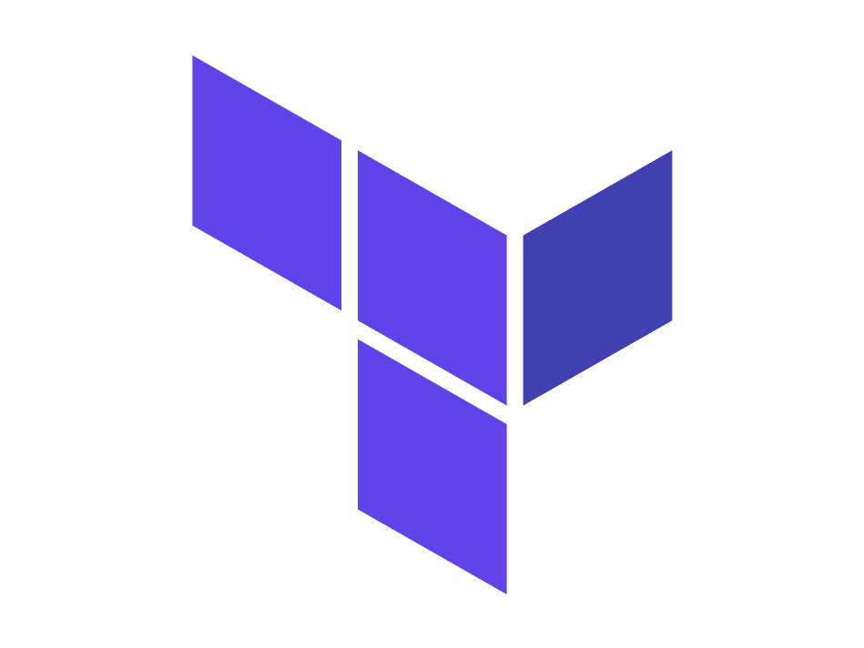
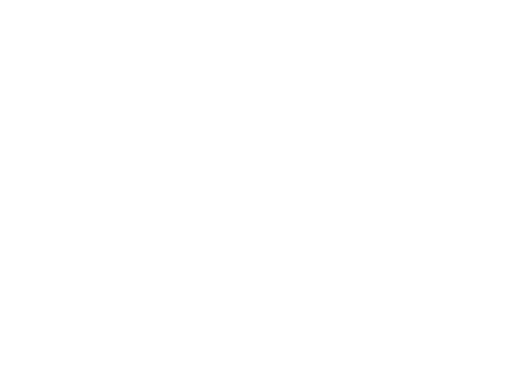
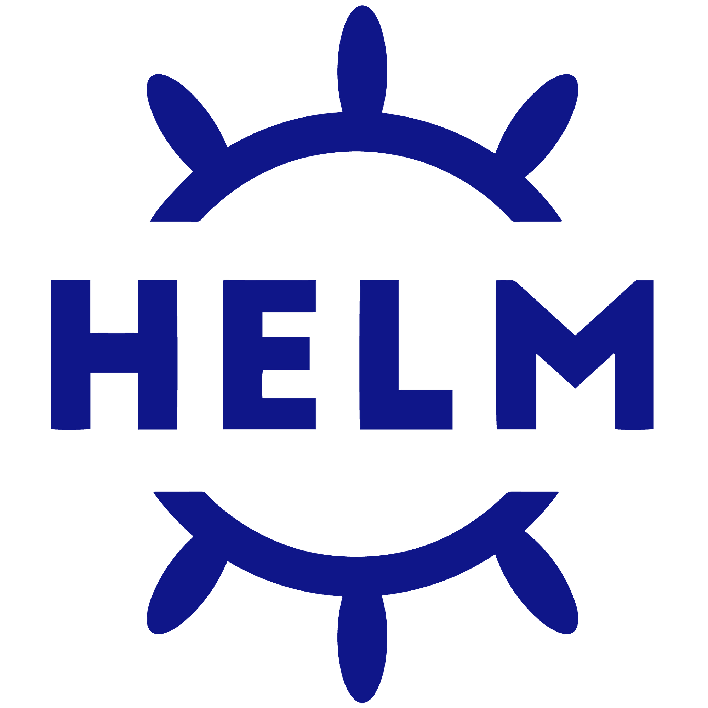
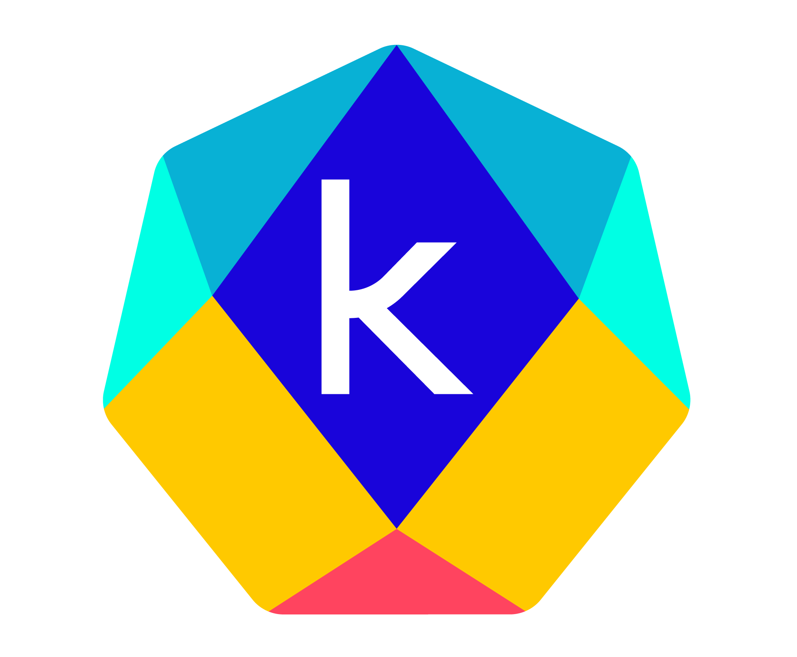
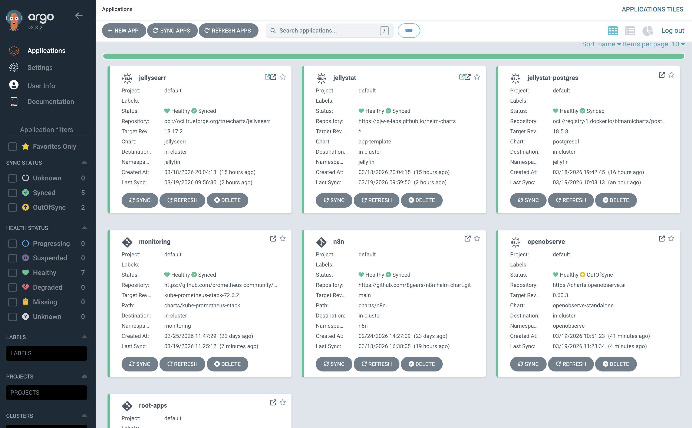
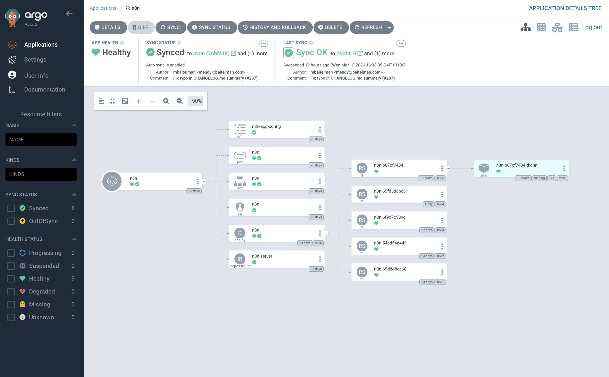
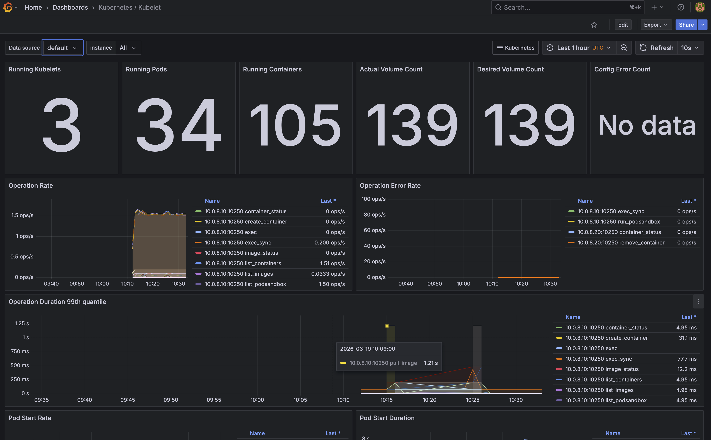
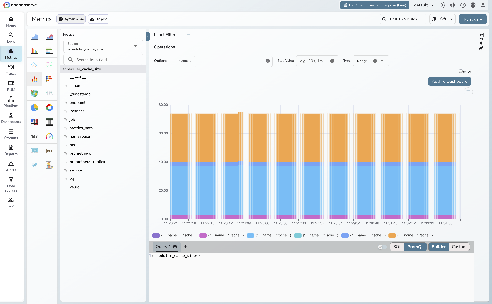
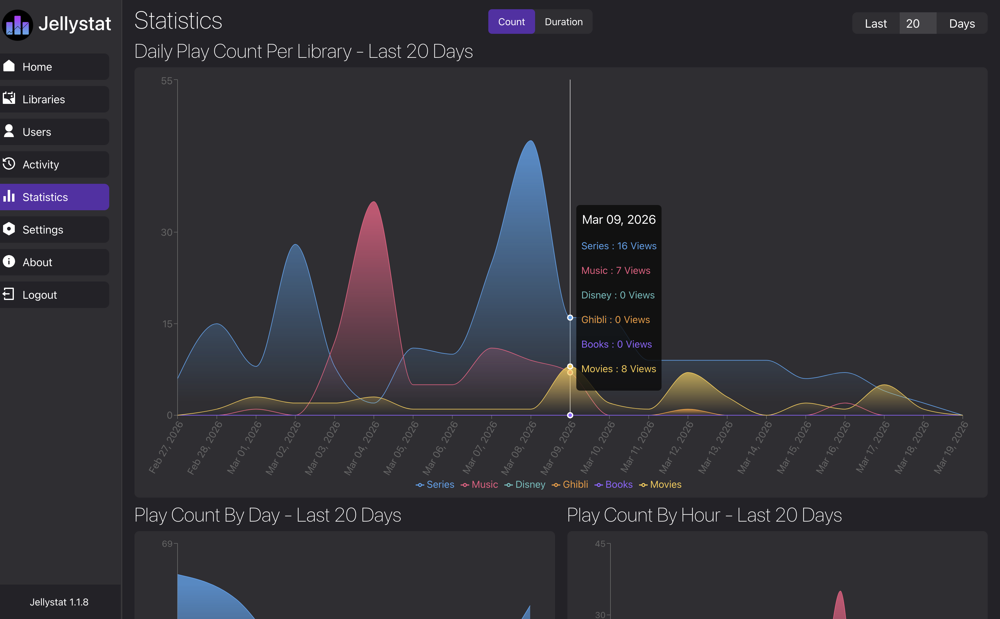

<!-- font_size: 2 -->

Infrastructure Kubernetes K3s
===

# Sommaire

- Architecture du Cluster
- IaC / Provisionning
- Arborescence du Projet
- GitOps & Flux de Déploiement
- Écosystème Applicatif
- Observabilité
- Stratégies de Déploiement
- Sécurité & DevSecOps
- Outillage (Nix)
- Demo

<!-- end_slide -->

<!-- font_size: 2 -->

# Architecture du Cluster

Le cluster repose sur **K3s** avec des nœuds sous Ubuntu 24.04 LTS.

| Node       | Rôle            | Système          |
|------------|-----------------|------------------|
| **k3s-cp**     | Control-Plane   | Ubuntu 24.04 LTS |
| **k3s-wk-01**  | Worker          | Ubuntu 24.04 LTS |
| **k3s-wk-02**  | Worker          | Ubuntu 24.04 LTS |

---


<!-- end_slide -->

<!-- font_size: 2 -->

# IaC

Pour le déploiement des machines du cluster nous utilisons terraform et ansible avec le provider Proxmox :

<!-- column_layout: [1, 1, 1] -->

<!-- column: 0 -->



<!-- column: 1 -->


<!-- column: 2 -->



<!-- reset_layout -->

Une structure claire - une branche par déploiement :

- **terraform/** : Contient les configurations pour la création des machines.
- **ansible/** : Contient les playbooks pour la configuration des machines.

### Documentation complète sur Github 

<!-- end_slide -->

<!-- font_size: 2 -->

# Arborescence du Projet

Une structure claire :

* **helm-apps/** : Contient toutes les définitions d'applications (charts Helm uniquement).



<!-- end_slide -->

<!-- font_size: 2 -->

# GitOps avec ArgoCD

Nous utilisons le pattern **"App of Apps"**.

1. **L'Application Racine** (`root-app.yaml`) surveille le dossier `helm-apps/`.
2. Elle déploie automatiquement toute nouvelle application définie.


<!-- end_slide -->

<!-- font_size: 2 -->

# Flux de Déploiement

Le cycle de vie d'une modification :

1. **Push** sur la branche `main`.
2. **CI (GitHub Actions)** : vérification du code et scan de sécurité (Trivy).
3. **Détection** automatique par ArgoCD.
3. **Synchronisation** des manifests sur le cluster.
4. **Vérification** de l'état de santé des ressources.


<!-- end_slide -->

<!-- font_size: 2 -->

# Écosystème Applicatif

Nous hébergeons quelques services, tous déployés via **charts Helm** :

* **Jellyfin, Jellyseerr & Jellystat** : Plateforme de streaming, recommandations et statistiques.
* **n8n** : Automatisation de vos flux de travail.
* **Grafana, Prometheus, OpenObserve** : Observabilité


<!-- end_slide -->

<!-- font_size: 2 -->

# Observabilité

Pour respecter la nécessité DevOps de "surveiller" son infrastructure :

<!-- column_layout: [1, 1, 1] -->

<!-- column: 0 -->

**Prometheus**
Moteur de collecte de métriques. Il "scrape" l'état de notre cluster K3s (utilisation GPU, CPU, RAM) ainsi que de jellyfin via un exporter.


<!-- column: 1 -->

**Grafana**
Outil de visualisation. Offre des *Dashboards* permettant d'être proactif sur les incidents.


<!-- column: 2 -->

**OpenObserve**
Plateforme d'observabilité unifiée (logs, traces, métriques). Nous l'utilisons pour collecter les logs de nos applications et du cluster.


<!-- reset_layout -->

<!-- end_slide -->

<!-- font_size: 2 -->

# Stratégies de Déploiement

Nos mises à jour se font sans coupure de service.

* **Rolling Update (ArgoCD + Kubernetes)** :
  1. L'image (ou la config) change dans Git.
  2. Kubernetes déploie le *nouveau* Pod.
  3. Il redirige le trafic, puis détruit l'*ancien* Pod.
  -> Résultat : **Zéro-Downtime** (pas d'arrêt pour l'utilisateur).

* *Evolution possible* : Déploiements incrémentaux **Canary** par exemple.


<!-- end_slide -->

<!-- font_size: 2 -->

# Sécurité & DevSecOps

Nous intégrons la sécurité à plusieurs niveaux :

* **CI (GitHub Actions) + Trivy** : Scan automatique des vulnérabilités et erreurs de configuration (IaC) à chaque Push/PR.
* **Audit Kubernetes** : Utilisation de `kube-bench` pour vérifier la sécurité du cluster face aux standards.
* **Gestion des secrets** : Manuel (Opaque) pour l'instant, avec évolution prévue vers Vault / SOPS.



<!-- end_slide -->

<!-- font_size: 2 -->

# Outillage : Nix

<!-- column_layout: [1, 1] -->

<!-- column: 0 -->


Utilisation de **Nix Flakes** pour garantir que tous les intervenants utilisent les mêmes versions des outils :

* `kubectl`
* `helm`
* `argocd`
* ...

Fini le "ça marche sur ma machine" !

<!-- column: 1 -->


<!-- reset_layout -->

<!-- end_slide -->

<!-- font_size: 2 -->

DEMO
===

* quelques commandes de bases kube

---

```bash +exec
kubectl get pods -n jellyfin
```

<!-- end_slide -->

<!-- font_size: 2 -->

DEMO
===

---

```bash +exec
kubectl get namespace
```

<!-- end_slide -->

DEMO
===

<!-- end_slide -->

<!-- font_size: 2 -->

Visuel de l'interface ArgoCD
===




<!-- end_slide -->

<!-- font_size: 2 -->

Visuel d'un deploiement ArgoCD
===




<!-- end_slide -->

<!-- font_size: 2 -->

Visuel d'un dashboard Grafana
===



<!-- end_slide -->

<!-- font_size: 2 -->

Visuel de l'interface OpenObserve
===




<!-- end_slide -->

<!-- font_size: 2 -->

Jellyfin
===


<!-- end_slide -->

<!-- font_size: 2 -->

Jellyseerr
===


<!-- end_slide -->

<!-- font_size: 2 -->

Jellystat
===



<!-- end_slide -->

<!-- font_size: 2 -->

Merci de votre attention !
===

# Des questions ?

# Sources
* Sources : GitHub Repo - https://github.com/ANdroxee/Devops-B3
* Documentation : [Kubernetes / ArgoCD / Helm]
* Tout les outils utilisés sont gratuits et open-source (voir README)