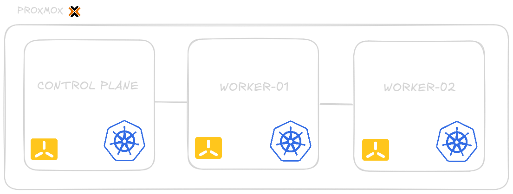

# Infrastructure Kubernetes K3s
## Projet DevOps B3

<!-- end_slide -->

# Architecture du Cluster

Le cluster repose sur **K3s** avec des nœuds sous Ubuntu 24.04 LTS.

| Node       | Rôle            | Système          |
|------------|-----------------|------------------|
| **k3s-cp**     | Control-Plane   | Ubuntu 24.04 LTS |
| **k3s-wk-01**  | Worker          | Ubuntu 24.04 LTS |
| **k3s-wk-02**  | Worker          | Ubuntu 24.04 LTS |



<!-- end_slide -->

# Arborescence du Projet

Une structure claire pour la gestion Helm et ArgoCD :

* **helm-apps/** : Contient toutes les définitions d'applications.
    * `root-app.yaml` : L'entrée principale (App of Apps).
    * `jellyseerr/`, `jellystat/`, `n8n/`, `monitoring/` : Configuration spécifique par service.
* **media/** : Assets et schémas d'architecture.
* **flake.nix** : Environnement de développement reproductible.

<!-- end_slide -->

# GitOps avec ArgoCD

Nous utilisons le pattern **"App of Apps"**.

1. **L'Application Racine** (`root-app.yaml`) surveille le dossier `helm-apps/`.
2. Elle déploie automatiquement toute nouvelle application définie.


<!-- end_slide -->

# Flux de Déploiement

Le cycle de vie d'une modification :

1. **Push** sur la branche `main`.
2. **Détection** automatique par ArgoCD.
3. **Synchronisation** des manifests sur le cluster.
4. **Vérification** de l'état de santé des ressources.


<!-- end_slide -->

# Applications Déployées

Un écosystème complet de services :

* **Streaming & Media** : Jellyfin, Jellyseerr, Jellystat.
* **Automation** : n8n.
* **Observabilité** : Prometheus & Grafana.


<!-- end_slide -->

# Gestion des Secrets

Approche actuelle : **Secrets Opaques manuels**.

```bash
kubectl create secret generic jellystat-secrets \
  --namespace jellyfin \
  --from-literal=POSTGRES_PASSWORD='***' \
  --from-literal=JWT_SECRET='***'
```

*Note : Des solutions comme HashiCorp Vault ou SOPS sont envisagées pour le futur.*

<!-- end_slide -->

# Outillage : Nix

<!-- column_layout: [1, 1] -->

<!-- column: 0 -->

Utilisation de **Nix Flakes** pour garantir que tous les intervenants utilisent les mêmes versions des outils :

* `kubectl`
* `helm`
* `argocd`
* ...

Fini le "ça marche sur ma machine" !

<!-- column: 1 -->


<!-- reset_layout -->

<!-- end_slide -->

# Merci de votre attention !

### Questions ?

* Sources : [GitHub Repo]
* Documentation : [Kubernetes / ArgoCD / Helm]
